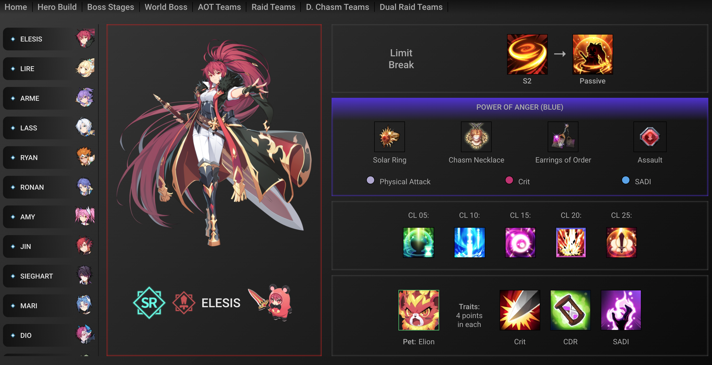

# Grand Chase Guide

A companion app, for the mobile game Grand Chase, that formats in-game data as a searchable archive of game resources, optimal chracter builds, and team compositions. The player community is constantly asking for builds, team compositions, and where to gather specific resources. None of this information existed in one consistent space.

## Tech/Framework Used

**Built with**
- [React](https://reactjs.org/)
- [Styled Components](https://styled-components.com/)
- [React Router](https://reacttraining.com/react-router/)